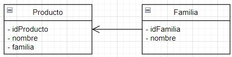
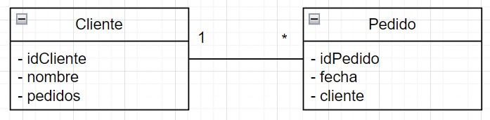
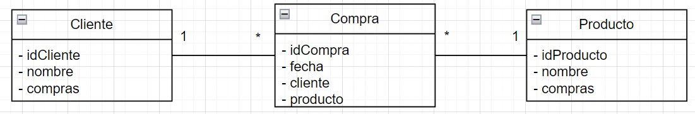

# Relaciones de Entidades a Diagrama de Clases

Para trasladar una relación de una base de datos a un diagrama de clases, debes entender cómo las relaciones en una base de datos se traducen a las relaciones en la programación orientada a objetos.

A continuación figuran unos ejemplos de las relaciones más comunes:

> Ejemplo:  Tenemos una relación entre las entidades Producto y Familia, donde un Producto pertenece a una familia 

En este caso tenemos dos entidades: `Producto` y `Familia`. Esto se traduce en una **relación de asociación** en un diagrama de clases.

Aquí está el pseudocódigo para las clases Producto y Familia:

```plaintext

Clase Producto:
  - Atributos:
    - idProducto: int
    - nombre: String
    - familia: Familia  // Este es el atributo que representa la relación con la Familia

Clase Familia:
  - Atributos:
    - idFamilia: int
    - nombre: String
  - 
```
Y aquí está cómo se vería en un diagrama de clases UML:



La flecha desde Producto a Familia indica que Producto tiene una referencia a Familia, lo que significa que un Producto pertenece a una Familia.

> Ejemplo: Tenemos que reflejar una relación un Cliente realiza de cero a n Pedidos

Para representar la relación entre un `Cliente` y sus `Pedidos` en un diagrama de clases, puedes usar una **asociación de uno a muchos**. Un `Cliente` puede tener cero a muchos `Pedidos`, y cada `Pedido` está asociado a exactamente un `Cliente`.

Aquí está el pseudocódigo para las clases `Cliente` y `Pedido`:

```plaintext
Clase Cliente:
  - Atributos:
    - idCliente: int
    - nombre: String
    - pedidos: Lista<Pedido>  // Este es el atributo que representa la relación con los Pedidos

Clase Pedido:
  - Atributos:
    - idPedido: int
    - fecha: Date
    - cliente: Cliente  // Este es el atributo que representa la relación con el Cliente
```

Y aquí está cómo se vería en un diagrama de clases UML:



En este diagrama, la línea entre `Cliente` y `Pedido` representa la relación entre las dos clases. El "1" cerca de `Cliente` indica que cada `Pedido` está asociado a exactamente un `Cliente`. El "*" cerca de `Pedido` indica que un `Cliente` puede tener cero a muchos `Pedidos`.

Por lo tanto, aunque es una sola línea, representa ambas relaciones: "un `Cliente` tiene muchos `Pedidos`" y "un `Pedido` tiene un `Cliente`".

> Ejemplo: Una relación de muchos a muchos entre Clientes y Productos en el contexto de una tienda. Un cliente puede comprar muchos Productos y un Producto puede ser comprado por muchos Clientes

Para representar una relación de muchos a muchos en un diagrama de clases, generalmente necesitamos una clase intermedia para romper la relación de muchos a muchos en dos relaciones de uno a muchos. En este caso, podríamos tener una clase `Compra` que representa cada compra individual de un `Producto` por un `Cliente`.

Aquí está el pseudocódigo para las clases `Cliente`, `Producto` y `Compra`:

```plaintext
Clase Cliente:
  - Atributos:
    - idCliente: int
    - nombre: String
    - compras: Lista<Compra>  // Este es el atributo que representa la relación con las Compras

Clase Producto:
  - Atributos:
    - idProducto: int
    - nombre: String
    - compras: Lista<Compra>  // Este es el atributo que representa la relación con las Compras

Clase Compra:
  - Atributos:
    - idCompra: int
    - fecha: Date
    - cliente: Cliente  // Este es el atributo que representa la relación con el Cliente
    - producto: Producto  // Este es el atributo que representa la relación con el Producto
```
Y aquí está cómo se vería en un diagrama de clases UML:



Una relación de muchos a muchos podría ser, por ejemplo, entre `Clientes` y `Productos` en el contexto de una tienda. Un `Cliente` puede comprar muchos `Productos` y un `Producto` puede ser comprado por muchos `Clientes`. 


